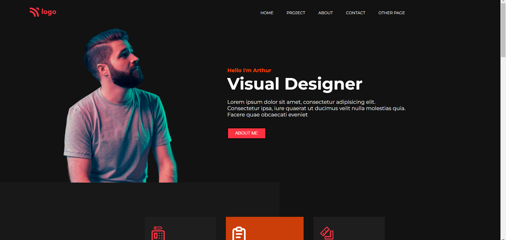
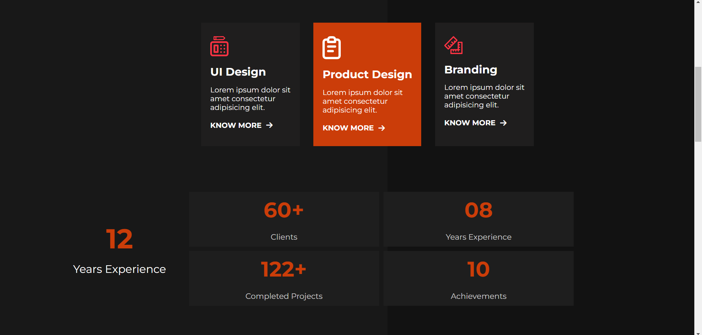
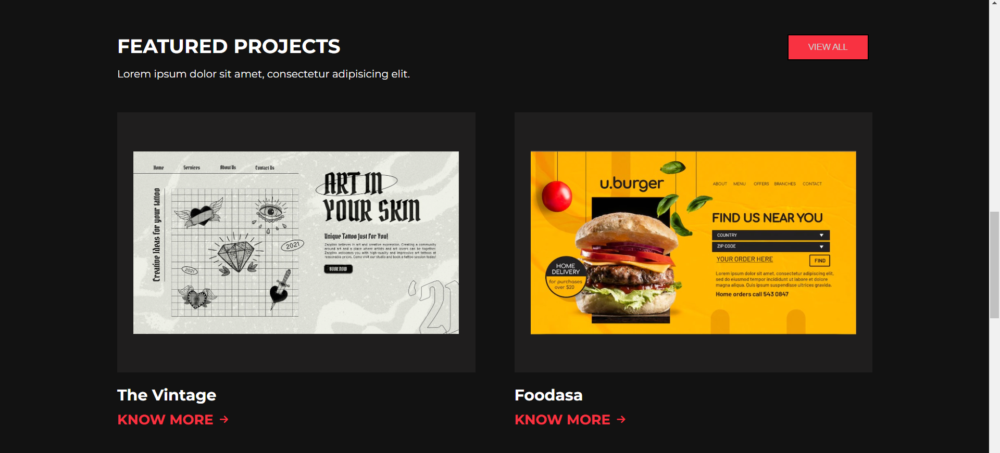
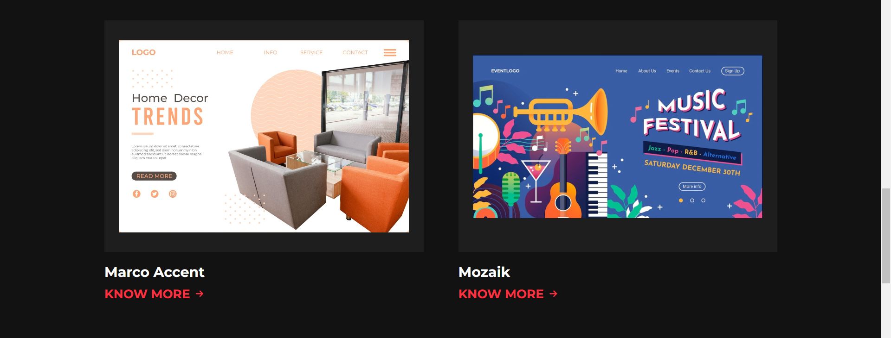
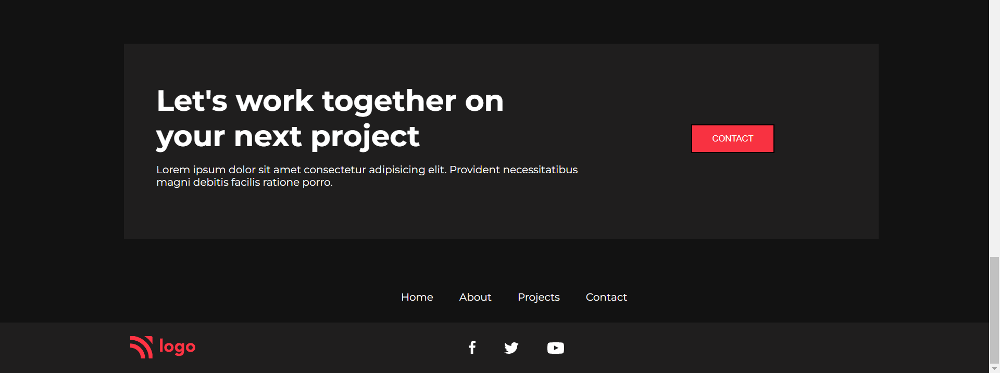

# Project 15

## Project 15 [Live link]()

- Skills Gained in this project 
    - Learned to create background box for visual design.
    - Learned to use external fontawesome icon library
    - Gained indepth knowledge of **flexbox**.
    

## Time Taken to Complete this project
    -10 Hours taken to Complete it.

### ScreenShot

